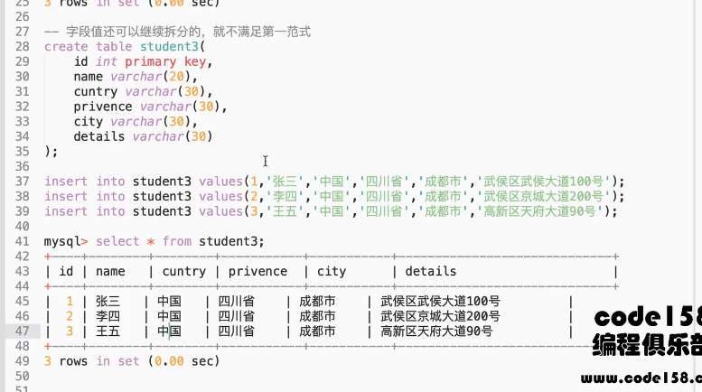
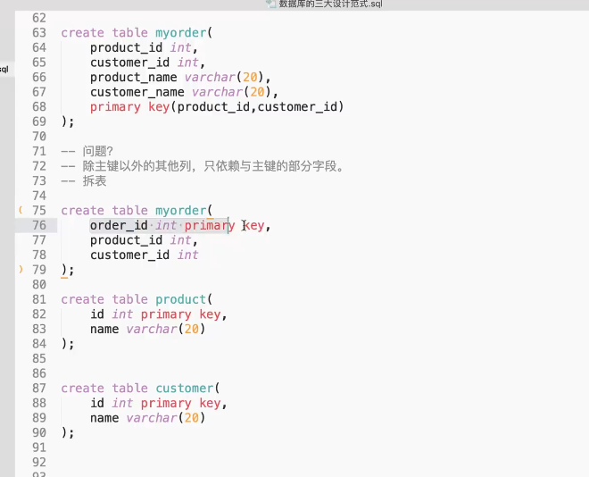

# mysql 学习笔记

## 如何使用终端操作数据库

* [ ] 如何登录数据库服务器

> C:\software\mysql-8.0.25-winx64\bin>mysql -uroot -proot

* [ ] 如何查询数据库服务器中所有的的数据库

```
mysql> show databases ;
+--------------------+
| Database           |
+--------------------+
| information_schema |
| mysql              |
| performance_schema |
| sys                |
+--------------------+

```

* [ ] 如何选中某一个数据库进行的操作

```
mysql> use sys
Database changed
```

* [ ] 如何退出数据库服务器

```
mysql> exit
Bye
```

* [ ] 如何在数据库服务器中创建我们的数据库

```
mysql> create database test;
Query OK, 1 row affected (0.01 sec)
```

* [ ] 如何查看某个数据库中所有的数据表

```
mysql> use test;
Database changed
//查看数据表是否创建成功
mysql> show tables;
Empty set (0.01 sec)
```

* [ ] 如何创建一个数据表

```
mysql> CREATE TABLE pet(
    ->  name VARCHAR(20),
    ->  owner VARCHAR(20),
    ->  species VARCHAR(20),
    ->  sex char(1),
    ->  birth DATE,
    ->  death DATE);
Query OK, 0 rows affected (0.03 sec)
```

* [ ] 查看创建好的数据表的结构

```
mysql> describe pet;
+---------+-------------+------+-----+---------+-------+
| Field   | Type        | Null | Key | Default | Extra |
+---------+-------------+------+-----+---------+-------+
| name    | varchar(20) | YES  |     | NULL    |       |
| owner   | varchar(20) | YES  |     | NULL    |       |
| species | varchar(20) | YES  |     | NULL    |       |
| sex     | char(1)     | YES  |     | NULL    |       |
| birth   | date        | YES  |     | NULL    |       |
| death   | date        | YES  |     | NULL    |       |
+---------+-------------+------+-----+---------+-------+
6 rows in set (0.00 sec)
```

* [ ] 查看数据表中的记录？

```
mysql> select * from pet;
Empty set (0.00 sec)
mysql> select * from pet;
+----------+-------+---------+------+------------+-------+
| name     | owner | species | sex  | birth      | death |
+----------+-------+---------+------+------------+-------+
| puffball | diane | hamster | f    | 1999-03-30 | NULL  |
+----------+-------+---------+------+------------+-------+
1 row in set (0.00 sec)
```

* [ ] 如何往数据表中插入数据记录

```
mysql> insert into pet
    -> values('puffball','diane','hamster','f','1999-03-30',NULL);
Query OK, 1 row affected (0.01 sec)

mysql> select * from pet;
+----------+-------+---------+------+------------+-------+
| name     | owner | species | sex  | birth      | death |
+----------+-------+---------+------+------------+-------+
| puffball | diane | hamster | f    | 1999-03-30 | NULL  |
+----------+-------+---------+------+------------+-------+
1 row in set (0.00 sec)
```

* [ ] 整形类型

| 类型         | 大小                                     | 范围（有符号）                                                                                                                      | 范围（无符号）                                                    | 用途             |
| ------------ | ---------------------------------------- | ----------------------------------------------------------------------------------------------------------------------------------- | ----------------------------------------------------------------- | ---------------- |
| TINYINT      | 1 byte                                   | (-128，127)                                                                                                                         | (0，255)                                                          | 小整数值         |
| SMALLINT     | 2 bytes                                  | (-32 768，32 767)                                                                                                                   | (0，65 535)                                                       | 大整数值         |
| MEDIUMINT    | 3  bytes                                 | (-8 388 608，8 388 607)                                                                                                             | (0，16 777 215)                                                   | 大整数值         |
| INT或INTEGER | 4  bytes                                 | (-2 147 483 648，2 147 483 647)                                                                                                     | (0，4 294 967 295)                                                | 大整数值         |
| BIGINT       | 8  bytes                                 | (-9,223,372,036,854,775,808，9 223 372 036 854 775 807)                                                                             | (0，18 446 744 073 709 551 615)                                   | 极大整数值       |
| FLOAT        | 4  bytes                                 | (-3.402 823 466 E+38，-1.175 494 351 E-38)，0，(1.175 494 351 E-38，3.402 823 466 351 E+38)                                         | 0，(1.175 494 351 E-38，3.402 823 466 E+38)                       | 单精度``浮点数值 |
| DOUBLE       | 8  bytes                                 | (-1.797 693 134 862 315 7 E+308，-2.225 073 858 507 201 4 E-308)，0，(2.225 073 858 507 201 4 E-308，1.797 693 134 862 315 7 E+308) | 0，(2.225 073 858 507 201 4 E-308，1.797 693 134 862 315 7 E+308) | 双精度``浮点数值 |
| DECIMAL      | 对DECIMAL(M,D) ，如果M>D，为M+2否则为D+2 | 依赖于M和D的值                                                                                                                      | 依赖于M和D的值                                                    | 小数值           |

* [ ] 日期类型

| DATE      | 3 | 1000-01-01/9999-12-31                                                                                                                         | YYYY-MM-DD          | 日期值                   |
| --------- | - | --------------------------------------------------------------------------------------------------------------------------------------------- | ------------------- | ------------------------ |
| TIME      | 3 | '-838:59:59'/'838:59:59'                                                                                                                      | HH:MM:SS            | 时间值或持续时间         |
| YEAR      | 1 | 1901/2155                                                                                                                                     | YYYY                | 年份值                   |
| DATETIME  | 8 | 1000-01-01 00:00:00/9999-12-31 23:59:59                                                                                                       | YYYY-MM-DD HH:MM:SS | 混合日期和时间值         |
| TIMESTAMP | 4 | 1970-01-01 00:00:00/2038 结束时间是第**2147483647**秒，北京时间 **2038-1-19 11:14:07** ，格林尼治时间 2038年1月19日 凌晨 03:14:07 | YYYYMMDD HHMMSS     | 混合日期和时间值，时间戳 |

* [ ] 字符串类型

| CHAR       | 0-255 bytes           | 定长字符串                      |
| ---------- | --------------------- | ------------------------------- |
| VARCHAR    | 0-65535 bytes         | 变长字符串                      |
| TINYBLOB   | 0-255 bytes           | 不超过 255 个字符的二进制字符串 |
| TINYTEXT   | 0-255 bytes           | 短文本字符串                    |
| BLOB       | 0-65 535 bytes        | 二进制形式的长文本数据          |
| TEXT       | 0-65 535 bytes        | 长文本数据                      |
| MEDIUMBLOB | 0-16 777 215 bytes    | 二进制形式的中等长度文本数据    |
| MEDIUMTEXT | 0-16 777 215 bytes    | 中等长度文本数据                |
| LONGBLOB   | 0-4 294 967 295 bytes | 二进制形式的极大文本数据        |
| LONGTEXT   | 0-4 294 967 295 bytes | 极大文本数据                    |

数据类型如何选择

日期选择按照格式，数字和字符串按照大小

* [ ] 如何删除数据

```
mysql> delete from pet where name='puffball';
Query OK, 2 rows affected (0.01 sec)

mysql> SELECT * FROM PET;
+---------+-------------+---------+------+------------+-------+
| name    | owner       | species | sex  | birth      | death |
+---------+-------------+---------+------+------------+-------+
| wangcai | zhouxingchi | gou     | b    | 1999-04-24 | NULL  |
| fully   | hasd        | cat     | g    | 1993-02-04 | NULL  |
| CLWA    | hasd        | DOG     | B    | 1995-02-04 | NULL  |
| LISI    | hasd        | DOG     | B    | 1995-06-04 | NULL  |
| BOWERSE | DIANE       | DOG     | B    | 1999-06-04 | NULL  |
+---------+-------------+---------+------+------------+-------+
5 rows in set (0.00 sec)
```

* [ ] 如何修改数据

```
mysql> update pet set name='旺财' where owner='zhouxingchi';
Query OK, 1 row affected (0.01 sec)
Rows matched: 1  Changed: 1  Warnings: 0

mysql> SELECT * FROM PET;
+---------+-------------+---------+------+------------+-------+
| name    | owner       | species | sex  | birth      | death |
+---------+-------------+---------+------+------------+-------+
| 旺财    | zhouxingchi | gou     | b    | 1999-04-24 | NULL  |
| fully   | hasd        | cat     | g    | 1993-02-04 | NULL  |
| CLWA    | hasd        | DOG     | B    | 1995-02-04 | NULL  |
| LISI    | hasd        | DOG     | B    | 1995-06-04 | NULL  |
| BOWERSE | DIANE       | DOG     | B    | 1999-06-04 | NULL  |
+---------+-------------+---------+------+------------+-------+
5 rows in set (0.00 sec)
```

总结：数据记录常见操作

增加：insert

删除：delete

改：update

查：select

## mysql建表约束

+ 主键约束

  它能够为唯一固定一张表中的一条记录，也就是我们通过某个字段添加约束，就可以使得该字段不重复且不为空

  mysql> create table user(id int **primary key**,name varchar(20));

  ```
  mysql> create table user(id int primary key,name varchar(20));
  Query OK, 0 rows affected (0.02 sec)

  mysql> show tables;
  +----------------+
  | Tables_in_test |
  +----------------+
  | pet            |
  | testtype       |
  | user           |
  +----------------+
  3 rows in set (0.00 sec)

  mysql> select * from user;
  +----+--------+
  | id | name   |
  +----+--------+
  |  1 | 张三   |
  +----+--------+
  1 row in set (0.00 sec)

  mysql> insert into user value(null,'张三');
  ERROR 1048 (23000): Column 'id' cannot be null
  //设置主键约束后，该字段不能重复且不能为空。
  ```

  联合主键：只要是联合的主键加起来不重复就可以了。

  ```
  mysql> create table user2(
      ->  id int,
      ->  name varchar(20),
      ->  password varchar(20),
      ->  primary key(id,name)
      -> );
  Query OK, 0 rows affected (0.02 sec)

  mysql> insert into user2 values(0,'张三','123');
  Query OK, 1 row affected (0.01 sec)

  mysql> insert into user2 values(0,'张三','123');
  ERROR 1062 (23000): Duplicate entry '0-张三' for key 'user2.PRIMARY'
  mysql> insert into user2 values(1,'张三','123');
  Query OK, 1 row affected (0.01 sec)
  ```
+ 外键约束
+ 自增约束

  ```
  mysql> create table user3(
      ->  id int primary key auto_increment,
      ->  name varchar(20)
      -> );
  Query OK, 0 rows affected (0.03 sec)
  mysql> insert into user3(name) values('zhoushi');
  Query OK, 1 row affected (0.01 sec)

  mysql> select * from user3;
  +----+---------+
  | id | name    |
  +----+---------+
  |  1 | 张三    |
  |  2 | 里斯    |
  |  3 | 里斯    |
  |  4 | zhoushi |
  +----+---------+
  4 rows in set (0.00 sec)
  ```

  如果创建表的时候忘记主键约束？

  ```
  create table user(id int,name varchar(20));
  mysql> alter table user1 add primary key(id);
  Query OK, 0 rows affected (0.04 sec)
  Records: 0  Duplicates: 0  Warnings: 0

  ```

  如何删除主键？

  ```
  mysql> alter table user1 drop primary key;
  Query OK, 0 rows affected (0.04 sec)
  Records: 0  Duplicates: 0  Warnings: 0

  mysql> desc user1;
  +-------+-------------+------+-----+---------+-------+
  | Field | Type        | Null | Key | Default | Extra |
  +-------+-------------+------+-----+---------+-------+
  | id    | int         | NO   |     | NULL    |       |
  | name  | varchar(20) | YES  |     | NULL    |       |
  +-------+-------------+------+-----+---------+-------+
  2 rows in set (0.00 sec)

  ```

  修改主键

  ```
  alter table user1 modify id int primary key;
  mysql> alter table user1 modify id int primary key;
  Query OK, 0 rows affected (0.03 sec)
  Records: 0  Duplicates: 0  Warnings: 0

  mysql> desc user1;
  +-------+-------------+------+-----+---------+-------+
  | Field | Type        | Null | Key | Default | Extra |
  +-------+-------------+------+-----+---------+-------+
  | id    | int         | NO   | PRI | NULL    |       |
  | name  | varchar(20) | YES  |     | NULL    |       |
  +-------+-------------+------+-----+---------+-------+
  2 rows in set (0.00 sec)
  ```
+ 唯一约束

  ```
  create table user5(
  	id int,
  	name varchar(20)
  );
  mysql> alter table user5 add unique(name);
  Query OK, 0 rows affected (0.02 sec)
  Records: 0  Duplicates: 0  Warnings: 0

  mysql> desc user5;
  +-------+-------------+------+-----+---------+-------+
  | Field | Type        | Null | Key | Default | Extra |
  +-------+-------------+------+-----+---------+-------+
  | id    | int         | YES  |     | NULL    |       |
  | name  | varchar(20) | YES  | UNI | NULL    |       |
  +-------+-------------+------+-----+---------+-------+
  2 rows in set (0.00 sec)

  mysql> insert into user5 values(1,'zhangsan');
  Query OK, 1 row affected (0.01 sec)

  mysql> insert into user5 values(1,'zhangsan');
  ERROR 1062 (23000): Duplicate entry 'zhangsan' for key 'user5.name'
  mysql> insert into user5 values(1,'lisi');
  Query OK, 1 row affected (0.01 sec)

  mysql> desc user5;
  +-------+-------------+------+-----+---------+-------+
  | Field | Type        | Null | Key | Default | Extra |
  +-------+-------------+------+-----+---------+-------+
  | id    | int         | YES  |     | NULL    |       |
  | name  | varchar(20) | YES  | UNI | NULL    |       |
  +-------+-------------+------+-----+---------+-------+
  2 rows in set (0.00 sec)

  ```

  总结：

  + 建表的时候就添加约束；
  + 可以使用alter table ... add ...
  + alter table ... modify ...
  + 删除 alter table ... drop...
+ 非空约束

  ```
  mysql> create table user8(
      ->  id int,
      ->  name varchar(20) not null
      -> );
  Query OK, 0 rows affected (0.02 sec)

  mysql> desc user8;
  +-------+-------------+------+-----+---------+-------+
  | Field | Type        | Null | Key | Default | Extra |
  +-------+-------------+------+-----+---------+-------+
  | id    | int         | YES  |     | NULL    |       |
  | name  | varchar(20) | NO   |     | NULL    |       |
  +-------+-------------+------+-----+---------+-------+
  2 rows in set (0.00 sec)

  mysql> insert into user8 id values(1);
  ERROR 1064 (42000): You have an error in your SQL syntax; check the manual that corresponds to your MySQL server version
   for the right syntax to use near 'id values(1)' at line 1
  mysql> insert into user8 (id) values(1);
  ERROR 1364 (HY000): Field 'name' doesn't have a default value
  mysql> insert into user8 values(1,'zhangsan');
  Query OK, 1 row affected (0.01 sec)

  mysql> desc user8;
  +-------+-------------+------+-----+---------+-------+
  | Field | Type        | Null | Key | Default | Extra |
  +-------+-------------+------+-----+---------+-------+
  | id    | int         | YES  |     | NULL    |       |
  | name  | varchar(20) | NO   |     | NULL    |       |
  +-------+-------------+------+-----+---------+-------+
  2 rows in set (0.00 sec)

  mysql> select * from user8;
  +------+----------+
  | id   | name     |
  +------+----------+
  |    1 | zhangsan |
  +------+----------+
  1 row in set (0.00 sec)

  ```
+ 默认约束

  当设置字段时，如果没有传入值，就使用默认约束值。

  ```
  mysql> create table user9(
      ->  id int,
      ->  name varchar(20),
      ->  age int default 10
      -> );
  Query OK, 0 rows affected (0.02 sec)

  mysql> insert into user9 (id, name) values(1,'火葬三');
  Query OK, 1 row affected (0.01 sec)

  mysql> select * from user9;
  +------+-----------+------+
  | id   | name      | age  |
  +------+-----------+------+
  |    1 | 火葬三    |   10 |
  +------+-----------+------+
  1 row in set (0.00 sec)
  ```

  当使用值传入时，就不使用默认值。

  ```
  mysql> insert into user9 (id,name,age) values(2,'z',6);
  Query OK, 1 row affected (0.01 sec)

  mysql> select * from user9;
  +------+-----------+------+
  | id   | name      | age  |
  +------+-----------+------+
  |    1 | 火葬三    |   10 |
  |    2 | z         |    6 |
  +------+-----------+------+
  2 rows in set (0.00 sec)
  ```
+ 外键约束

  + 涉及到两个表，父表、子表
  + 主表、副表

  ```
  create table classes(
  	id int primary key,
  	name varchar(20)
  );

  //学生表
  create table students(
  	id int primary key,
  	name varchar(20),
  	class_id int,
  	foreign key(class_id)reference classes(id)
  );

  mysql> insert into classes values(1,'一班');
  Query OK, 1 row affected (0.01 sec)

  mysql> insert into classes values(2,'二班');
  Query OK, 1 row affected (0.01 sec)

  mysql> insert into classes values(3,'三班');
  Query OK, 1 row affected (0.01 sec)

  mysql> insert into classes values(4,'四班');
  Query OK, 1 row affected (0.01 sec)

  mysql> insert into classes values(5,'五班');
  Query OK, 1 row affected (0.01 sec)

  mysql> insert into students values(001,'zhangsan',1);
  Query OK, 1 row affected (0.01 sec)

  mysql> insert into students values(002,'zhanger',2);
  Query OK, 1 row affected (0.01 sec)

  mysql> insert into students values(003,'zhangwu',3);
  Query OK, 1 row affected (0.01 sec)

  mysql> insert into students values(004,'lisi',4);
  Query OK, 1 row affected (0.01 sec)

  mysql> insert into students values(005,'lisi',5);
  Query OK, 1 row affected (0.01 sec)

  mysql> insert into students values(006,'lisi',6);
  ERROR 1452 (23000): Cannot add or update a child row: a foreign key constraint fails (`test`.`students`, CONSTRAINT `stu
  dents_ibfk_1` FOREIGN KEY (`class_id`) REFERENCES `classes` (`id`))


  ```

  + 副表中不能增加主表中不存在的元素，
  + 主表中的记录被引用了，是不可以被删除的。

```
mysql> delete from classes where id=4;
ERROR 1451 (23000): Cannot delete or update a parent row: a foreign key constraint fails (`test`.`students`, CONSTRAINT
`students_ibfk_1` FOREIGN KEY (`class_id`) REFERENCES `classes` (`id`))
```

## 数据库的三大设计范式

1、第一范式

数据表中所有字段都是不可以分割的原子值？

```
create table student(
	id int primary key;
	name varchar(20),
	address varchar(30)
);
```



范式设计的越详细，对于某些实际操作可能会更好，但是不一定都是好处。

2、第二范式

必须满足第一范式的前提下，第二范式要求，除主键的每一列都必须完全依赖主键。

如果要出现不完全依赖，只可能发生在联合主键的情况下。



分成三个表之后就满足，第二范例。

3、第三范式

必须先满足第二范式，除主键列以外其他列之间不能有传递依赖关系。

## mysql查询练习

学生表

Students

学号

姓名

性别

出生年月日

所在班级

create  table Students(

```
s_no varchar(20) primary key,
```


```
s_name varchar(20) not null,
```


```
s_sex varchar(10) not null,
```


```
s_birthday datetime,
```


```
class varchar(20)
```


);

成绩表

Scores

学号

课程号

成绩


教师表

Teachers

教师编号

教师名字

教师性别

出生年月日

职称

所在部门
